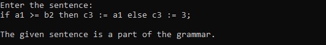
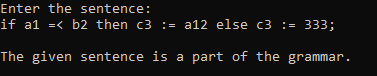
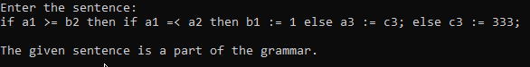
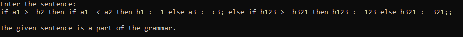
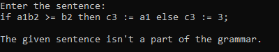
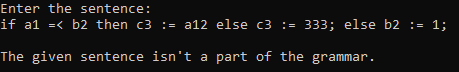

# Граматика
```
S -> if C then P else P;
C -> VB
B -> >= V | =< V
V -> aD | bD | cD
D -> 1{D} | 2{D} | 3{D}
P -> V := F | S
F -> V | D
```

# Приклади виконання програми
<br>
<br>
<br>
<br>
<br>

